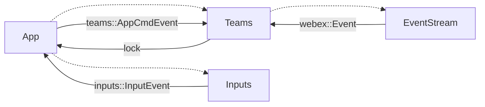

# Thread

Dotted lines indicate a thread spawning another.
Plain lines indicate a thread communicating to another.

```mermaid

graph LR
   App -..-> Teams & Inputs
   Teams -..-> EventStream
   
   App -- teams::AppCmdEvent --> Teams
   Teams -- lock --> App
   EventStream -- webex::Event --> Teams
   Inputs -- inputs::InputEvent --> App

```