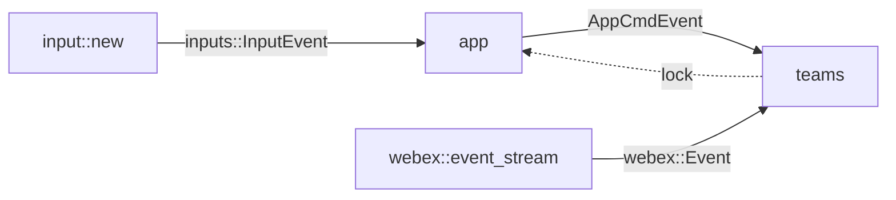

# How threads communicate

```mermaid
graph LR
   A[app] -- AppCmdEvent --> T[teams]
   T -. lock .-> A
   ES[webex::event_stream] -- webex::Event --> T
   I[input::new] -- inputs::InputEvent --> A

```